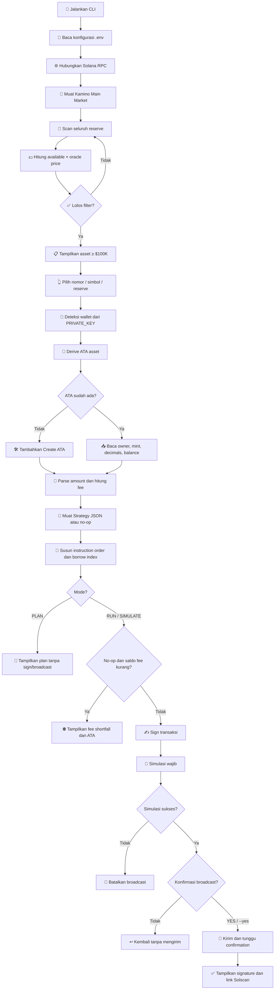
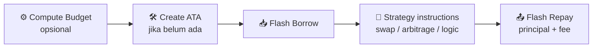

# ⚡ Kamino Flash-Loan Tools

CLI TypeScript untuk menemukan reserve, menyusun plan, menyimulasikan, dan mengeksekusi flash loan atomik melalui Kamino Lend di Solana Mainnet. Toolkit menggunakan SDK resmi Kamino serta pasangan instruksi `flashBorrowReserveLiquidity` dan `flashRepayReserveLiquidity`.

> ⚠️ **Mainnet warning:** broadcast mengirim transaksi riil. Principal dan fee wajib tersedia saat instruksi repay dijalankan dalam transaksi yang sama. Gunakan wallet khusus, RPC tepercaya, dan strategy yang sudah diaudit.

## ✨ Ringkasan fitur

- 🔎 Membaca 58 reserve Kamino Main Market langsung dari RPC Solana.
- 💵 Menghitung `VALUE` dari available liquidity dan oracle price Kamino.
- 🧹 Memfilter reserve dengan oracle valid, flashloan aktif, dan nilai minimal `$100K`.
- 🪙 Menampilkan 11 asset terpilih dan memilih reserve dengan nilai USD terbesar bila simbolnya duplikat.
- 👛 Membaca signer dari private key `.env`, lalu mendeteksi public wallet otomatis.
- 🧾 Menurunkan ATA berdasarkan wallet, mint, dan token program reserve.
- 🛠️ Menambahkan instruksi pembuatan ATA idempotent bila account belum ada.
- 🧮 Memproses nominal menggunakan integer base units tanpa floating-point.
- 💸 Menghitung fee dan fee shortfall sebelum simulasi.
- 🧩 Menyisipkan strategy atomik di antara flash borrow dan flash repay.
- 🧪 Mewajibkan simulasi sukses sebelum broadcast.
- 🔐 Memerlukan konfirmasi `YES` pada menu interaktif atau flag `--yes` pada command execute.
- 🔗 Menampilkan transaksi berhasil langsung di Solscan.

## 🪙 Asset yang ditampilkan

Fee selalu dibaca ulang dari state on-chain. Nilai berikut adalah konfigurasi saat dokumentasi diperbarui dan dapat berubah.

| Asset | Flashloan fee | Kelompok |
|---|---:|---|
| `cbBTC` | `0%` | Bitcoin |
| `dSOL` | `0%` | Liquid-staked SOL |
| `EURC` | `0%` | Stablecoin |
| `JitoSOL` | `0%` | Liquid-staked SOL |
| `JupSOL` | `0%` | Liquid-staked SOL |
| `PYUSD` | `0%` | Stablecoin |
| `USDG` | `0%` | Stablecoin |
| `USDS` | `0%` | Stablecoin |
| `USDC` | `0.001%` | Stablecoin |
| `USDT` | `0.001%` | Stablecoin |
| `WSOL` | `0.001%` | Wrapped native SOL |

Mint wrapped native `So11111111111111111111111111111111111111112` ditampilkan sebagai `WSOL`. Input `SOL`, `WSOL`, dan `SOL/WSOL` menunjuk reserve yang sama.

### 🆓 Memahami asset fee `0%`

Asset `cbBTC`, `dSOL`, `EURC`, `JitoSOL`, `JupSOL`, `PYUSD`, `USDG`, dan `USDS` saat ini memiliki `flashLoanFeeRate = 0` pada Kamino Main Market.

```text
Borrow      1,000 USDG
Kamino fee      0 USDG
Repay       1,000 USDG
```

Implikasinya:

- 🆓 Repayment hanya sebesar principal yang dipinjam.
- 🧪 Strategy `no-op` dapat digunakan tanpa saldo token awal untuk membayar fee.
- 🛠️ Jika ATA belum ada, CLI tetap membuatnya secara idempotent.
- ⛽ Wallet tetap membutuhkan SOL untuk rent ATA dan network fee Solana.
- ⚠️ Fee 0% bukan berarti transaksi bebas risiko; strategy, slippage, oracle, dan perubahan state tetap dapat menyebabkan kegagalan.

### 💸 Memahami asset yang memiliki fee

Asset `USDC`, `USDT`, dan `WSOL` saat ini memiliki flashloan fee sekitar `0.001%`.

```text
fee       = borrow amount × 0.001%
          = borrow amount × 0.00001

repayment = principal + fee
```

Contoh:

| Borrow | Fee 0.001% | Repayment |
|---:|---:|---:|
| `10 USDC` | `0.0001 USDC` | `10.0001 USDC` |
| `1,000 USDC` | `0.01 USDC` | `1,000.01 USDC` |
| `100,000 USDC` | `1 USDC` | `100,001 USDC` |

Implikasinya:

- 💰 `no-op` membutuhkan saldo awal token minimal sebesar fee.
- 🧩 Strategy nyata harus menghasilkan atau menyisakan principal + fee sebelum repay.
- ⛔ Jika saldo awal `no-op` kurang, CLI menghentikan proses dan menampilkan `FEE SHORTFALL` serta alamat ATA.
- ⛽ Network fee Solana dan rent ATA dibayar dalam SOL, terpisah dari fee flashloan.

### ⏱️ Ini fee, bukan APR

Istilah “bunga” di CLI merujuk pada **flashloan fee satu kali**, bukan APR/APY atau bunga berdasarkan durasi. Borrow dan repay terjadi dalam satu transaksi atomik, sehingga tidak ada bunga yang bertambah per detik, slot, hari, atau tahun.

Fee dibaca ulang dari reserve on-chain setiap kali plan dibuat. Kamino dapat mengubah konfigurasi fee, jadi angka pada tabel dokumentasi bukan nilai permanen.

## 🗺️ Peta alur lengkap



## 🧱 Urutan transaksi atomik

CLI menghitung `borrowInstructionIndex` dari susunan final, bukan memakai index hard-coded.



Urutan detail:

1. ⚙️ `preInstructions` dari strategy, hanya untuk Compute Budget Program.
2. 🛠️ Create Associated Token Account idempotent jika ATA belum ada.
3. 📥 `flashBorrowReserveLiquidity` mengirim token dari supply vault ke ATA wallet.
4. 🧩 Semua `instructions` strategy dijalankan.
5. 📤 `flashRepayReserveLiquidity` mengembalikan principal dan fee ke Kamino.

Jika langkah mana pun gagal, seluruh perubahan state transaksi dibatalkan secara atomik.

## 📦 Persyaratan dan instalasi

- Node.js `>=20`.
- Wallet Solana khusus dengan sedikit SOL untuk network fee dan rent ATA.
- RPC Solana Mainnet yang dapat diandalkan.
- Strategy instruction yang sudah diverifikasi untuk penggunaan nyata.

Clone repository dengan GitHub CLI:

```bash
gh repo clone FlipZ3ro/kamino-tools
cd kamino-tools
npm install
cp .env.example .env
npm run build
npm test
```

Jika source sudah tersedia secara lokal, lewati langkah clone dan masuk ke folder project:

```bash
cd /path/to/kamino-tools
npm install
cp .env.example .env
npm run build
npm test
```

> 💡 Jalankan `cp .env.example .env` hanya saat membuat konfigurasi pertama kali. Jangan jalankan ulang bila `.env` sudah berisi private key atau RPC milikmu karena file tersebut akan tertimpa.

## 🔐 Konfigurasi `.env`

```dotenv
SOLANA_RPC_URL=https://api.mainnet-beta.solana.com
KAMINO_MARKET=7u3HeHxYDLhnCoErrtycNokbQYbWGzLs6JSDqGAv5PfF

# Direkomendasikan: base58, JSON array 32/64 byte, atau comma-separated bytes.
PRIVATE_KEY=

# Fallback opsional bila PRIVATE_KEY kosong.
KEYPAIR_PATH=~/.config/solana/id.json
```

Prioritas signer:

1. 🔑 `SOLANA_PRIVATE_KEY`.
2. 🔑 `PRIVATE_KEY`.
3. 🔑 `WALLET_PRIVATE_KEY`.
4. 🔑 `PK`.
5. 📁 `KEYPAIR_PATH` sebagai fallback.

Private key tidak dicetak ke terminal dan tidak disarankan diberikan melalui argument command line. File `.env` dan keypair sudah diabaikan oleh Git.

## 🎛️ Interface interaktif

```bash
npm start
# atau
npm run interactive
```

Menu utama:

```text
1  LIQUIDITY SCAN  Find flash-borrowable reserves
2  FLASHLOAN PLAN  Validate wallet and strategy
3  RUN FLASHLOAN   Simulate, then optionally broadcast
0  EXIT
```

### 1️⃣ Liquidity Scan

Alurnya:

1. 🌐 Muat Kamino Main Market dari RPC.
2. 🔎 Baca seluruh reserve dan state terbarunya.
3. 🧮 Hitung:

   ```text
   available token = available base units ÷ 10^mint decimals
   value USD       = available token × oracle price
   ```

4. ✅ Pertahankan reserve yang flashloan-enabled, oracle-valid, dan bernilai minimal `$100K`.
5. 🪙 Pertahankan hanya 11 asset yang didukung tampilan.
6. 🏆 Jika ada simbol duplikat, pilih reserve dengan available value USD terbesar.
7. 📋 Tampilkan `ASSET`, `AVAILABLE`, `VALUE`, `FEE`, dan reserve address.

### 2️⃣ Flashloan Plan

Mode plan melakukan validasi dan menyusun urutan instruksi tanpa signing, simulasi, atau broadcast.

1. 📋 Tampilkan reserve yang bisa dipilih.
2. 👆 Pilih menggunakan nomor, simbol, atau reserve address.
3. 💰 Masukkan nominal token.
4. 👛 Deteksi wallet dan derive ATA otomatis.
5. 🧩 Masukkan path Strategy JSON, atau kosongkan untuk `no-op`.
6. 🔍 Validasi reserve, token account, mint, owner, decimals, liquidity, dan fee.
7. 📄 Tampilkan plan, instruction order, balance, estimated fee, dan fee shortfall.
8. 🛑 Tidak ada transaksi yang dikirim.

### 3️⃣ Run Flashloan

Mode run adalah jalur mainnet lengkap:

1. 📋 Pilih asset dan amount.
2. 👛 Deteksi wallet serta ATA.
3. 🛠️ Siapkan create ATA bila diperlukan.
4. 🧩 Muat strategy.
5. 💸 Jalankan fee preflight untuk `no-op`.
6. ✍️ Susun dan sign versioned transaction.
7. 🧪 Simulasikan transaksi dengan signature verification.
8. 🛑 Jika simulasi gagal, jangan broadcast.
9. ✅ Jika simulasi sukses, minta pengguna mengetik `YES`.
10. 📡 Broadcast hanya setelah jawaban persis `YES`.
11. ⏳ Tunggu confirmation.
12. 🔗 Tampilkan signature dan link `https://solscan.io/tx/<SIGNATURE>`.

## 💸 Fee, saldo awal, dan `no-op`

Flashloan selalu harus meninggalkan dana berikut di ATA sebelum repay:

```text
repayment = principal + flashloan fee
```

Contoh USDC:

```text
Borrow             10 USDC
Fee                0.0001 USDC
Repay              10.0001 USDC
Saldo awal ATA     0 USDC
Fee shortfall      0.0001 USDC
```

Untuk strategy kosong atau `no-op`, fee harus sudah tersedia di ATA sebelum transaksi. CLI akan menghentikan proses sebelum simulasi dan menampilkan nominal shortfall serta alamat ATA.

Untuk reserve dengan fee `0%`, `no-op` tidak memerlukan saldo token awal, tetapi wallet tetap membutuhkan SOL untuk rent ATA dan network fee. Untuk strategy nyata, preflight saldo awal dilewati karena strategy dapat menghasilkan repayment di antara borrow dan repay.

## 🤖 Command non-interaktif

### 🔎 Scan reserve

```bash
npm run cli -- reserves
npm run cli -- reserves --json
npm run cli -- reserves --asset WSOL --json
```

### 📄 Buat plan

ATA diturunkan otomatis dari signer dan asset:

```bash
npm run cli -- plan --asset USDC --amount 1000
```

Kunci reserve tertentu:

```bash
npm run cli -- plan \
  --reserve RESERVE_ADDRESS \
  --amount 1000
```

Override token account hanya untuk penggunaan tingkat lanjut:

```bash
npm run cli -- plan \
  --asset USDC \
  --amount 1000 \
  --token-account EXISTING_TOKEN_ACCOUNT
```

Token account override harus sudah ada, dimiliki wallet yang benar, dan mint-nya harus sesuai reserve. ATA yang diturunkan otomatis dapat dibuat oleh transaksi bila belum ada.

### 🧪 Simulasi tanpa broadcast

```bash
npm run cli -- simulate \
  --asset USDG \
  --amount 1000
```

Dengan strategy:

```bash
npm run cli -- simulate \
  --asset USDC \
  --amount 1000 \
  --strategy strategy.local.json
```

### 📡 Simulasi lalu broadcast

`execute` tetap menjalankan simulasi terlebih dahulu dan menolak broadcast bila simulasi gagal.

```bash
npm run cli -- execute \
  --asset USDC \
  --amount 1000 \
  --strategy strategy.local.json \
  --yes
```

Tanpa `--yes`, command `execute` berhenti sebelum menyusun transaksi mainnet.

### 💰 Treasure watcher (arb track)

Mendeteksi pool baru yang salah harga lintas venue (read-only). Harga dihitung dari **saldo vault live on-chain** — bukan cache aggregator yang terbukti bisa stale 200.000x. Filter: likuiditas dua arah (anti ghost), mint authority renounced + tanpa freeze (anti honeypot), dan diskon ≥5% vs harga referensi Jupiter.

```bash
# satu pass (prime baseline)
npm run cli -- treasure-scan

# watch mode + JSONL + Telegram alert otomatis
npm run cli -- treasure-scan \
  --watch \
  --interval 45 \
  --min-vault 1000 \
  --min-ratio 1.05 \
  --log data/treasure_events.jsonl
```

Contoh output:

```text
TREASURE SCAN  12:55:03  pools=7 real=1 opps=1 errors=0
[1] VENUE=pumpswap POOL=EaPkdue2qR4h… DISCOUNT=8.3% PRICE=934.65 nSOL REF=1.02 µSOL LIQ=198.94M base + 185.94 SOL
```

Venue yang di-watch: pumpswap, meteora-damm-v2, meteora-damm, raydium-clmm, orca-whirlpool (layout terverifikasi on-chain per 2026-09-05). Listing pool memakai `getProgramAccountsV2` Helius (paginasi) — venue berat (meteora-damm-v2, 1.45M pool) di-diff tiap 8 pass. Riset lengkap: `docs/ARB_TREASURE_RESEARCH.md`. Command legacy `arb-scan` (round-trip quote) masih tersedia untuk spot-check manual.

### 📊 Output JSON

Tambahkan `--json` untuk automation:

```bash
npm run cli -- reserves --json
npm run cli -- plan --asset USDG --amount 1000 --json
npm run cli -- simulate --asset USDG --amount 1000 --json
```

## 🧩 Format Strategy JSON

Salin template awal:

```bash
cp examples/strategy.example.json strategy.local.json
```

Format:

```json
{
  "name": "my-atomic-strategy",
  "preInstructions": [],
  "instructions": [
    {
      "programAddress": "PROGRAM_ADDRESS",
      "accounts": [
        { "address": "ACCOUNT_ADDRESS", "writable": true },
        { "address": "WALLET_ADDRESS", "signer": true }
      ],
      "dataBase64": "BASE64_INSTRUCTION_DATA"
    }
  ]
}
```

Aturan strategy:

- ⚙️ `preInstructions` hanya boleh menargetkan Compute Budget Program.
- 🧩 `instructions` ditempatkan persis di antara flash borrow dan flash repay.
- 🔐 Signer selain wallet utama ditolak.
- 🧾 `dataBase64` harus valid.
- 🚫 Strategy JSON dari sumber yang tidak dipercaya tidak boleh digunakan.
- 🏗️ Buat integrasi TypeScript khusus bila strategy membutuhkan signer tambahan atau address lookup table.

## ✅ Validasi yang dilakukan

| Tahap | Validasi |
|---|---|
| Reserve scan | Market, flashloan flag, available liquidity, oracle validity, value minimum |
| Asset selection | Nomor, simbol/alias, atau exact reserve address |
| Wallet | Private key 32/64 byte, public address, signer priority |
| Token account | ATA derivation, existence, owner, mint, decimals |
| Amount | Positif, precision sesuai decimals, tidak melebihi available reserve |
| Strategy | JSON shape, program address, accounts, signer, base64 data |
| Transaction | Setup count, dynamic borrow index, instruction ordering |
| Fee | Estimated fee, initial balance, no-op shortfall |
| Safety | Simulation wajib, explicit confirmation, no broadcast on failure |

## 🚦 Jalur gagal dan respons CLI

| Kondisi | Respons |
|---|---|
| RPC atau market gagal dimuat | Tampilkan error dan kembali ke menu |
| Asset tidak tersedia atau di bawah `$100K` | Tolak pilihan |
| Private key tidak valid | Tolak sebelum transaction build |
| ATA belum ada | Tambahkan create ATA idempotent |
| Override token account belum ada | Tolak dan sarankan memakai ATA otomatis |
| Owner/mint/decimals tidak cocok | Tolak sebelum simulasi |
| Amount melebihi reserve | Tolak sebelum signing |
| No-op kekurangan saldo fee | Tampilkan `FEE SHORTFALL` dan alamat ATA |
| Strategy gagal | Simulasi gagal, transaksi tidak dikirim |
| Pengguna tidak mengetik `YES` | Broadcast dibatalkan |
| Confirmation gagal | Tampilkan error; periksa signature/RPC sebelum mencoba ulang |

## 🛡️ Checklist sebelum mainnet

- ✅ Gunakan wallet khusus dengan dana terbatas.
- ✅ Pastikan RPC mengarah ke Solana Mainnet yang benar.
- ✅ Verifikasi reserve address dan mint.
- ✅ Periksa fee terbaru; konfigurasi reserve dapat berubah.
- ✅ Audit seluruh program address dan account flags pada strategy.
- ✅ Periksa quote expiry, slippage, minimum output, dan expected profit.
- ✅ Pastikan hasil akhir strategy menyediakan principal + fee.
- ✅ Jalankan `plan` lalu `simulate` sebelum `execute`.
- ✅ Baca seluruh simulation log.
- ✅ Buka hasil transaksi melalui Solscan.
- ❌ Jangan commit `.env`, private key, atau strategy berisi secret.

## 🧯 Troubleshooting

### `insufficient funds` saat flash repay

Borrow berhasil tetapi saldo sebelum repay tidak cukup untuk principal + fee. Isi ATA dengan fee shortfall untuk `no-op`, atau gunakan strategy yang menghasilkan repayment.

### ATA belum ada

Biarkan `--token-account` kosong. CLI akan derive ATA dan menambahkan create ATA idempotent. Wallet harus memiliki SOL untuk rent.

### `fetch failed`

Periksa `SOLANA_RPC_URL`, koneksi internet, DNS, dan rate limit RPC. Gunakan RPC privat untuk mainnet production.

### Warning WebSocket HTTP/2

Script npm memakai `--disable-warning=ExperimentalWarning` untuk menyembunyikan khusus warning experimental transport Node. Warning lain tetap terlihat.

### Terminal masih menampilkan alur lama

Hentikan proses lama dan restart:

```bash
Ctrl+C
npm start
```

## 🗂️ Struktur project

| File | Tanggung jawab |
|---|---|
| `src/cli.ts` | Command, menu interaktif, filtering, plan, fee preflight, orchestration |
| `src/kamino.ts` | Market/reserve SDK, oracle value, ATA, flash borrow/repay builder |
| `src/config.ts` | `.env`, private key parser, keypair fallback |
| `src/strategy.ts` | Strategy JSON parser dan instruction validation |
| `src/transaction.ts` | Versioned transaction, signing, simulation, confirmation |
| `src/amount.ts` | Parse/format token base units |
| `src/ui.ts` | Banner, warna, tabel, prompt, plan/simulation panels |
| `src/strategies/liquidation/` | Screener full-market, hot tracker, surge defense (watcher Phase 1) |
| `src/strategies/arb/` | Treasure watcher: venue layouts terverifikasi on-chain, pool feed GPA-diff, vault-truth pricing, ghost filter, opportunity math |
| `src/alerts/telegram.ts` | Alerter Telegram (liquidation + treasure vocabulary) |
| `test/` | Unit tests amount, config, strategy, UI, serializer, screener, tracker, telegram, arb/treasure |
| `research/` | Probe scripts riset empiris (reproducibility, bukan bagian app) |
| `docs/` | Build plans, competitor intel, websocket design, treasure research |

## ⚠️ Batasan

- Satu flash borrow per transaksi.
- Strategy JSON adalah low-level instruction input, bukan DEX route builder.
- CLI belum mengambil quote arbitrage atau slippage otomatis.
- Address lookup table tambahan belum dimuat dari Strategy JSON.
- Pembuatan ATA membutuhkan rent SOL.
- Nilai USD dan fee adalah snapshot saat reserve dibaca; state dapat berubah sebelum broadcast.
- Simulasi sukses mengurangi risiko, tetapi tidak menjamin transaksi mainnet tetap sukses jika state berubah.

## 🔍 Dependency security

`npm audit --omit=dev` saat project dibuat melaporkan advisory transitif dari dependency legacy yang dibawa SDK resmi Kamino 11.0.2 (`bigint-buffer`/`@solana/web3.js` dan `uuid`). `npm audit fix --force` menawarkan downgrade breaking ke SDK 7.x sehingga tidak diterapkan.

Pantau rilis SDK Kamino, audit ulang sebelum production, dan jangan menerima Strategy JSON dari sumber yang tidak dipercaya.

## 📚 Referensi resmi

- 🧰 Kamino Lend SDK: <https://github.com/Kamino-Finance/klend-sdk>
- 🏦 Kamino Lend program: <https://github.com/Kamino-Finance/klend>
- 🔗 Solscan: <https://solscan.io>
- 🆔 Program ID: `KLend2g3cP87fffoy8q1mQqGKjrxjC8boSyAYavgmjD`
